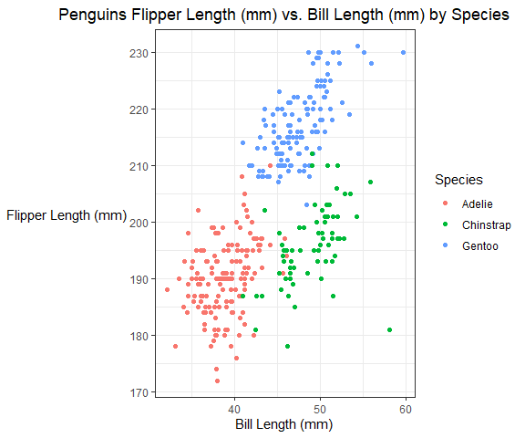
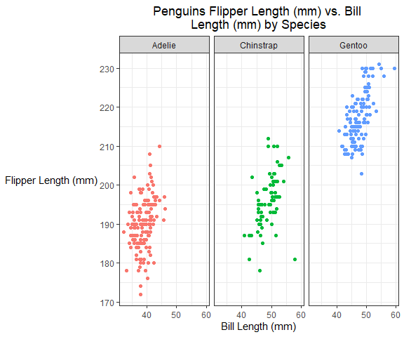

PUBH 7462 Rmarkdown Template
================
Eric Connor

# 2. Best Practices and Consistent Style

## 2.1 Independent Bivariate Normal Random Sample

### Create a tibble (data frame) with 3 variables: x = a random sample of size n = 1000 from N(0,1), y = a random sample of size n = 1000 from N(1,2), sum\_indicator = a logical variable with TRUE if x + y &gt; 0.5

A tibble with 3 variables was created, one with a random normal
distribution of 1000 samples with mean 0 and standard deviation 1, while
another is a random normal distribution of 1000 samples with mean 1 and
standard deviation 2, and the final variable being an indicator of TRUE
if the random normal distribution values from x + y exceeds 0.5.

``` r
set.seed(1)
IBN_sample <- tibble(x = rnorm(1000, mean = 0, sd = 1),
                     y = rnorm(1000, mean = 1, sd = 2),
                     sum_indicator = ifelse(x + y > 0.5, TRUE, FALSE))

IBN_sample <- IBN_sample %>%
  mutate(sum_indicator = ifelse(sum_indicator == TRUE, "Yes", "No"),
         sum_indicator = fct_relevel(factor(sum_indicator), "Yes", "No"))

IBN_sample %>%
  ggplot(aes(x = x, y = y, color = sum_indicator)) +
  geom_point() +
  xlab("X = N(0,1) variable") +
  ylab("Y = N(1,2) variable") +
  ggtitle("Scatter Plot of N(0,1) and N(1,2) distributions among \ndifference greater than 0.5") +
  theme_classic() +
  theme(plot.title = element_text(hjust = 0.5),
        axis.title.y = element_text(angle = 0, vjust = 0.5)) +
  scale_color_discrete(name = "Difference Indicator", labels = c("x + y > 0.5", expression("x + y" <= 0.5)))
```


# 2.2 Penguin EDA

Import Penguins data:

``` r
penguin.df <- read_rds("./data/penguin.RDS")
```

## 2.2.1 Data Description

Each observation or row in the penguins dataset contains information
about a particular penguin. The dataset consists of 344 different
penguins and 8 different variables. The various variables in the dataset
are:

-   Species: Penguin Species (Adelie, Chinstrap, or Gentoo)
-   Island: The penguins home island in Antarctica (Biscoe, Dream, or
    Torgersen)
-   bill\_length\_mm: Bill Length (in millimeters) of Penguin
-   bill\_depth\_mm: Bill Depth (millimeters) of penguin
-   flipper\_length\_mm: Flipper Length (in millimeters) of penguin
-   body\_mass\_g: Body Mass (in grams) of penguin
-   sex: Sex of Penguin (Male or Female)
-   year: Study Year

Calculate Mean and standard deviation of flipper length and bill length
of penguins accounting for missing data

``` r
mean(penguin.df$flipper_length_mm, na.rm = TRUE)
```

    ## [1] 200.9

``` r
sd(penguin.df$flipper_length_mm, na.rm = TRUE)
```

    ## [1] 14.06

``` r
mean(penguin.df$bill_length_mm, na.rm = TRUE)
```

    ## [1] 43.92

``` r
sd(penguin.df$bill_length_mm, na.rm = TRUE)
```

    ## [1] 5.46

The average flipper length of a penguin is 200.9 millimeters with a
standard deviation of 14.06 millimeters. In addition, the average bill
length of a penguin is 43.92 millimeters with a standard deviation of
5.46 millimeters.

## 2.2.2 Visualization

``` r
penguin.df %>%
  ggplot(aes(x = bill_length_mm, y = flipper_length_mm, color = species)) +
  geom_point() +
  xlab("Bill Length (mm)") +
  ylab("Flipper Length (mm)") +
  ggtitle("Penguins Flipper Length (mm) vs. Bill Length (mm) by Species") +
  theme_bw() +
  theme(plot.title = element_text(hjust = 0.5),
        axis.title.y = element_text(angle = 0, vjust = 0.5)) +
  scale_color_discrete(name = "Species")
```



``` r
penguin.df %>%
  ggplot(aes(x = bill_length_mm, y = flipper_length_mm, color = species)) +
  geom_point() +
  xlab("Bill Length (mm)") +
  ylab("Flipper Length (mm)") +
  ggtitle("Penguins Flipper Length (mm) vs. Bill \nLength (mm) by Species") +
  theme_bw() +
  facet_wrap(~species) +
  theme(plot.title = element_text(hjust = 0.5),
        axis.title.y = element_text(angle = 0, vjust = 0.5),
        legend.position = "none") +
  scale_color_discrete(name = "Species")
```



From Plot 1, it can be observed that Adelie species penguins tend to
have the shorter bill and the smallest flipper, whereas Gentoo penguins
typically have a much larger flipper length and a longer bill length. In
contrast, Chinstrap penguins tend to have nearly the same flipper length
as Adelie penguins but have substantially longer bill lengths than these
penguins. In addition, from Plot 2, each species of penguins has its own
cluster of flipper length and bill length. These species of penguins
typically are well distinguished on Antarctica because of these bill
length differences and flipper length differences.
